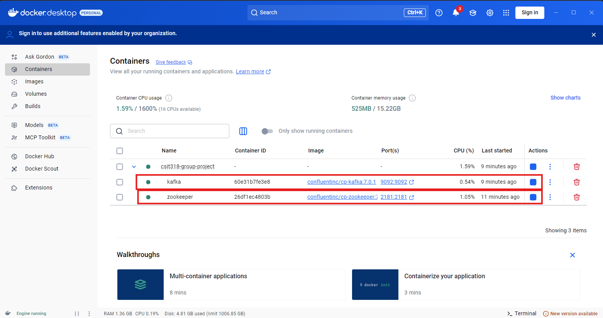

# CSIT318-Project 

Welcome to our project! The project overall is an AI assisted educational resource ordering + assisted learning
service that provides users an easy way to access resources for educational purpose, however also suggesting resources
that may be suitable, while also assisting in pinpointing key information within these resources collected.

Altogether we have the following 5 microservices
- ### Account Service
- ### Order Service
- ### Guides Service (Agentic Component)
- ### Resource Service
- ### Suggestion Service (Agentic Component)

Below you should find outlined test cases alongside code to assist in hitting each use case of our system.
# Introduction to our services + test code
## Prerequisites:
> [!CAUTION]
> Failure to complete these steps will prevent the project from executing
- `Google Gemini API Key` (can be created at https://aistudio.google.com/api-keys):
  - Create a new environment variable for both the Guide-Service and Suggestion-Service, it must be formatted `GEMINI_API_KEY={api_key}`
- `Youtube API Key` (can be created at https://aistudio.google.com/api-keys):
  - Create a new environment variable for both the Guide-Service, it must be formatted `YOUTUBE_API_KEY={api_key}`
- `Docker Desktop` must be installed on your system
  - Once you have opened docker desktop, run the following command at the root directory (./CSIT-381-Group-Project)
```
docker-compose up -d
```

This should then create 2 containers within your docker container registry, ensure both containers have started, then you can proceed with the tests below.


## Start up all Microservices in the following order:
> [!IMPORTANT]  
> If you are unable to click "Start Application" for each one of these services, you may need to run ```mvn spring-boot:run``` within the directory of each service in a separate terminal
1. Resource Service
2. Accounts Service
3. Order Service
4. Guides Service
5. Suggestion Service
# Account Service
1. Viewing all user accounts
```
curl -X GET http://localhost:8080/api/users 
```

2. Creating an account
```
curl -X POST http://localhost:8080/api/users -H "Content-Type: application/json" -d '{"email": "test.user@gmail.com", "firstName": "Test", "lastName": "User"}'
```

3. Viewing a specific user account (provide a ```{userId}``` from a result of step 1)
```
curl -X GET http://localhost:8080/api/users/{userId} 
```

4. Modifying a specific user account (provide a ```{userId}``` from a result of step 1)
```
curl -X PUT http://localhost:8080/api/users/{userId} -H "Content-Type: application/json" -d '{"lastName": "User-Modified"}'
```

6. Cancelling a membership
```
curl -X POST http://localhost:8080/api/users/{userId}/cancel-membership
```
# Resource Service

1. Collect all resources
```
curl -X GET http://localhost:8081/resources
```

2. Collect a specific resource (provide a ```{resourceId}``` from a result of step 1)
```
curl -X GET http://localhost:8081/resources/{resourceId}
```

# Order Service

```
curl -X POST http://localhost:3000/api/example -H "Content-Type: application/json" -d '{"name": "Alice", "age": 30}'
```

# Guide Service
1. Collect all guides
```
curl -X GET http://localhost:8082/guides
```
2. Collect a specific guide (provide a ```{guideId}``` from a result of step 1)
```
curl -X GET http://localhost:8082/guide/{guideId}
```
3. Collect a guide by resourceID and researchGoal
```
curl -X GET http://localhost:8082/guide -F "resourceId={resourceId}" -F "researchGoal={researchGoal}"
```
4. Create or update guide
```
curl -X POST http://localhost:8082/guide -H "Content-Type: application/json" -d '{"resourceId": "{resourceId}", "researchGoal": "I want to learn how to create better abstracts", "Summary": "A summary of the guide", "relatedSections": [], "externalVideos": []}'
```
5. Generate a guide for an article (Agentic Component) (provide a ```{filePath}``` of your own, otherwise copy the full path for mockpaper.md from guides-service/mockpaper.md)
```
curl -X POST "http://localhost:8082/guideAgent" -H "Content-Type: multipart/form-data" -F "researchGoal=Understanding nutrition for athletes" -F "file=@{filePath}"
```

# Suggestion Service
1. Get All existing suggestions within the suggestionRepository
```
curl -X GET http://localhost:8084/suggestions
```
2. Get a stored suggestion by ID (substitute ```{suggestionId}``` with the ID of  suggestion collected from step 1)
```
curl -X GET http://localhost:8084/suggestions/{suggestionId}
```
3. Generate a suggestion via manual input filters (you can modify the body to accept any Educational Resource properties, in this case we are using the ```knowledgeLevel``` property)
```
curl -X POST http://localhost:8084/suggestions/generate -H "Content-Type: application/json" -d '{"knowledgeLevel": "Beginner"}'
```
4. Generate a suggestion from a user's order history (Agentic Component) (substitute ```{userId}``` for a userId from step 2 of the account service tests)
```
curl -X POST http://localhost:8084/suggestions/generate/{userId}/orderHistory
```
5. Generate a suggestion from a user's profile preferences (Agentic Component) (substitute ```{userId}``` for a userId from step 2 of the account service tests)
```
curl -X POST http://localhost:8084/suggestions/generate/{userId}/userPreferences
```

# Events Simulation
If you haven't already, ensure Apache Kafka is running on your machine:\
[Go to Prerequisites](#prerequisites) and follow the Apache Kafka cmd steps
# Streaming Simulation
```
example for streaming simulation
```